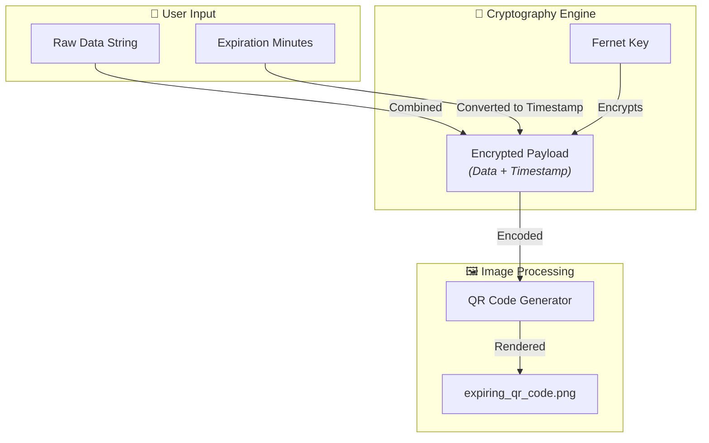
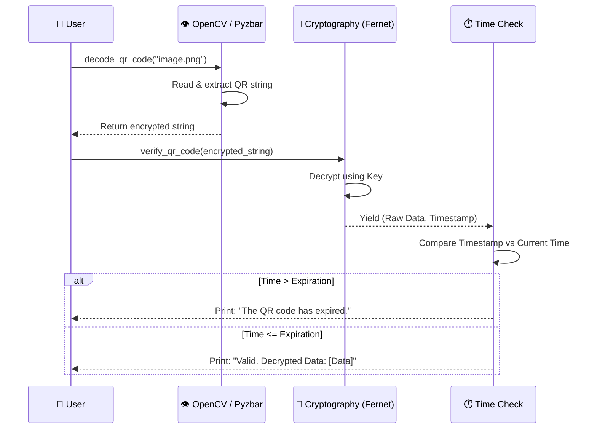

<div align="center">

# 🔐 Secure Expiring QR Code Generator

### A Python-based utility to encrypt, generate, and decode time-sensitive QR codes.

[](https://www.python.org/)
[](https://opencv.org/)
[](https://cryptography.io/en/latest/)

</div>

---

## 📌 About

This project is a powerful security utility that combines symmetric encryption with QR code generation to create **time-sensitive, encrypted QR codes**. By leveraging the Fernet encryption algorithm, any text data is securely locked behind a generated key and timestamped. Once the designated expiration period elapses, the data becomes invalid and cannot be successfully verified, making this ideal for temporary ticketing, secure access tokens, or sensitive data sharing.

---

## ✨ Features

- **Symmetric Encryption** — Data is heavily encrypted using `cryptography.fernet` before being embedded into the QR code.
- **Time-Bomb Expiration** — Embeds a Unix timestamp; decoded data is automatically rejected if the current time exceeds the expiration limit.
- **Dynamic QR Generation** — Utilizes the `qrcode` library to build scalable, machine-readable matrices.
- **Computer Vision Decoding** — Integrates `cv2` (OpenCV) and `pyzbar` to accurately scan and extract data from the generated image files.
- **No Internet Required** — All cryptographic functions and image processing happen 100% locally.

---

## 🏗️ System Architecture



---

## 🔄 Request Flow (Verification Process)



---

## 🛠️ Tech Stack

| Layer | Technology | Purpose |
|:---:|:---|:---|
| **Language** | Python 3 | Core scripting and execution |
| **Cryptography** | `cryptography` (Fernet) | Advanced symmetric encryption |
| **Image Encoding**| `qrcode[pil]` | Generating the visual QR matrix |
| **Image Decoding**| `opencv-python`, `pyzbar` | Reading and interpreting QR matrices |

---

## 📂 Project Structure

```text
Secure-QR-Code-Generator/
├── index.py              # Main execution script containing all logic
├── README.md             # Project documentation
└── expiring_qr_code.png  # (Generated dynamically upon script execution)
```

---

## 🚀 Getting Started

### Prerequisites
- Python 3.8+
- System level library for pyzbar (e.g., `libzbar0` on Linux)

### 1. Install Dependencies
It is highly recommended to run this in a virtual environment or a Google Colab notebook to avoid local dependency conflicts.

```bash
# Linux (Ubuntu/Debian) requirement for Pyzbar:
sudo apt-get install libzbar0

# Install Python packages:
pip install pyzbar opencv-python qrcode[pil] cryptography
```

### 2. Run the Script
```bash
python index.py
```

### 3. Usage Steps
1. The script automatically generates a secure Fernet key.
2. You will be prompted to enter a string: `Enter the data to store in QR:`
3. The script embeds a hardcoded 1-minute expiration timer (configurable in code).
4. `expiring_qr_code.png` is generated and saved in the directory.
5. The script prompts `do you want to decode the qr y/n` — press `y` to test the decryption and expiration validation.

---

## 📄 License

This project is open source and available under the MIT License.

---

<div align="center">

**Built with ❤️ by [Ziaur Rahman](https://github.com/iZiaur)**

</div>
